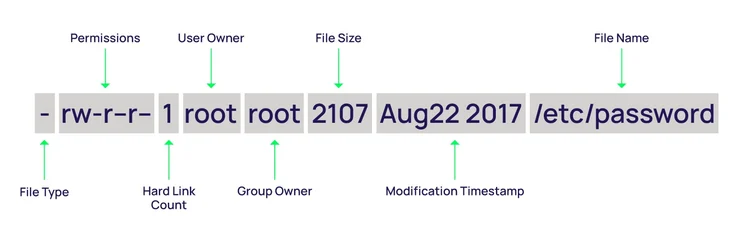

# LINUX檔案權限
- 參考資料 [Privilege escalation on Linux: When it’s good and when it’s a disaster (with examples)](https://delinea.com/blog/linux-privilege-escalation)
- Linux系統的所有檔案都有一個權限表示其允許或拒絕其他人查看、修改或執行它們
- 超級使用者“root"可以存取系統中任何檔案
- 每個檔案都有一個存取限制，使用者限制和擁有者/組屬性與之關聯。
- 每個檔案依照重要性具有如下三種權限:(Permission Groups):
  - 擁有者(Owner):適用於該檔案的擁有者
  - 群組(Group):適用於該檔案所屬的群組
  - 其他(All Users):適用於其他所有使用者
- 權限類型(Permission Types)
  - Read讀 = 4
  - Write寫 = 2
  - Execute執行 = 1
  - `–`沒有權限 (No permissions set) = 0
- 權限運算:
  - 5 == 4+1 ==>有 `讀`與`執行`的權限
  - 7 == 4+2+1 ==>有 `讀``寫`與`執行`的權限

# 範例: ls -al
```
-rw-r--r--  1 root root  1255 Mar 16  2024 .bash_history
-rw-r--r--  1 root root  3391 May  8  2019 .bashrc
drwx------  2 root root  4096 Jul 22  2019 .BurpSuite
```


- 第一個位元
  - _ - no special permissions set
  - d ==> directory(代表是一個目錄)
  - l ==> file has symbolic links
  - s ==> setuid or setgid is set
  - t ==> sticky bit set
# 改變權限的指令[chmod](https://zh.wikipedia.org/zh-tw/Chmod) ==> `ch`ange `mod`e
- 只有檔案所有者(owner)和超級使用者(root)可以修改檔案或目錄的權限。
- 可以使用絕對模式（八進制數位模式:0,1,2,3,4,5,6,7），符號模式指定檔案的權限。
  - chmod 664 myfile
  - chmod u+x filename
    - u ==>user ==> 使用者本人
    - + ==> 增加權限
    - x ==> 檔案執行權限 
  - 對mydir目錄的所有者u和關聯組g增加讀r和寫w權限 ==> chmod ug+rw mydir

# 範例2: cat /etc/passwd
```
root:x:0:0:root:/root:/bin/bash
daemon:x:1:1:daemon:/usr/sbin:/usr/sbin/nologin
bin:x:2:2:bin:/bin:/usr/sbin/nologin
sys:x:3:3:sys:/dev:/usr/sbin/nologin
sync:x:4:65534:sync:/bin:/bin/sync
games:x:5:60:games:/usr/games:/usr/sbin/nologin
man:x:6:12:man:/var/cache/man:/usr/sbin/nologin
lp:x:7:7:lp:/var/spool/lpd:/usr/sbin/nologin
```


